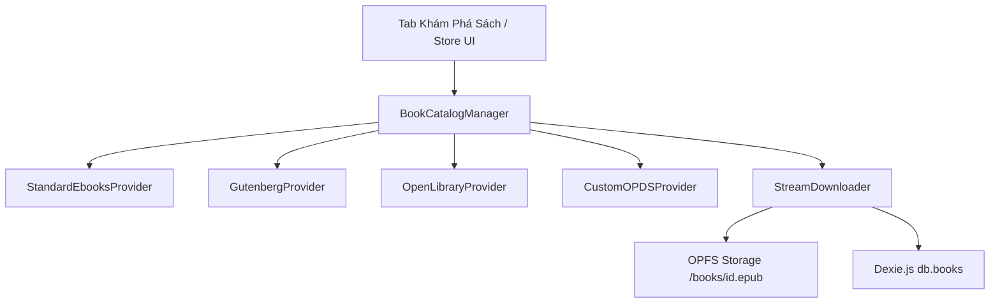

# Giai Đoạn 6: Khám Phá & Tải Sách Trực Tuyến (Online Book Discovery & OPDS Engine)

## 🎯 Mục Tiêu
Tích hợp kho sách trực tuyến mở ngay bên trong Velvet, cho phép người đọc tìm kiếm hàng trăm ngàn đầu sách miễn phí chất lượng cao (Standard Ebooks, Project Gutenberg, Open Library) và tải trực tiếp 1-click vào thư viện OPFS. Hỗ trợ giao thức OPDS Catalog để kết nối kho sách cá nhân (Calibre).

---

## 🏗️ Kiến Trúc Module

---

## 📋 Các Thành Phần Kỹ Thuật

### 1. Catalog Providers Service (`src/services/catalogService.ts`)
- **Standard Ebooks Feed**:
  * Tích hợp OPDS feed: `https://standardebooks.org/opds/all`
  * Trích xuất: Bìa sách độ nét cao, tiêu đề, tác giả, tóm tắt, dung lượng, đường dẫn tải trực tiếp file `.epub`.
- **Project Gutenberg API**:
  * Sử dụng Gutendex API (`https://gutendex.com/books?search=...`) để tìm kiếm theo tên sách/tác giả/chủ đề và lấy link download EPUB.
- **Open Library Search**:
  * Tìm kiếm meta qua `https://openlibrary.org/search.json?q=...`
- **Custom OPDS Client**:
  * Cho phép người dùng nhập URL OPDS cá nhân (vd: Calibre Web, Kavita, COPS).
  * Phân tích XML/Atom feed & OPDS 1.2 / 2.0.

### 2. Stream Downloader & Auto-Import (`src/services/downloadService.ts`)
- Tải tệp `.epub` theo cơ chế stream có thanh tiến độ (Progress Bar).
- Tự động gọi `BookService.importBook(downloadedFile)` để đưa vào OPFS và Dexie.
- Đổi trạng thái nút thành "Đọc Ngay" khi hoàn tất tải.

### 3. Giao Diện Khám Phá Chuẩn Apple Books (`src/components/store/StoreDrawer.tsx` / `StoreView.tsx`)
- Tab **"Khám Phá Sách"** trên thanh điều hướng đầu trang.
- Bố cục danh mục:
  * **Sách Nổi Bật (Featured Classics)**
  * **Sách Mới Thêm (Recently Added)**
  * **Tìm kiếm toàn cầu đa nguồn** với bộ lọc ngôn ngữ (*Tiếng Việt, Tiếng Anh, Pháp...*)
- Thẻ sách Store với nút 1-click **"Tải về thư viện"**.

---

## 🧪 Kế Hoạch Kiểm Thử
1. Tìm kiếm từ khóa "Sherlock Holmes", "Pride and Prejudice", "The Great Gatsby".
2. Tải về và xác nhận file lưu đúng vào OPFS `books/{id}.epub` và xuất hiện ngay trên Thư Viện.
3. Mở sách vừa tải kiểm tra hiển thị typography chuẩn xác.
