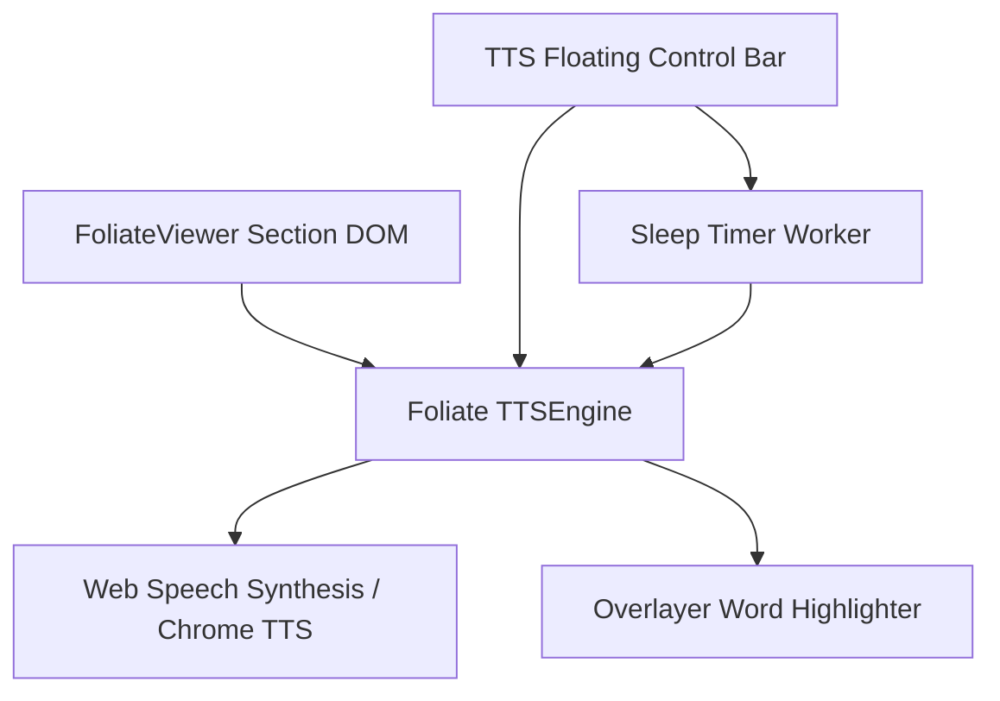

# Giai Đoạn 7: Trợ Lý Đọc Sách Text-To-Speech (TTS Voice & Smart Word Sync)

## 🎯 Mục Tiêu
Cung cấp trải nghiệm nghe sách audio rảnh tay cao cấp bằng giọng đọc AI/Browser Web Speech. Tự động đồng bộ dải highlight theo từng câu/từ khi giọng đọc chạy qua, điều chỉnh tốc độ và hẹn giờ tắt.

---

## 🏗️ Kiến Trúc Module

---

## 📋 Các Thành Phần Kỹ Thuật

### 1. Foliate TTS Engine Controller (`src/services/ttsService.ts`)
- Tích hợp module `foliate-js/tts.js`.
- Bóc tách văn bản theo cấu trúc cây DOM của từng section trong EPUB (bỏ qua header/footer/ảnh để đọc liền mạch).
- Giao tiếp với `window.speechSynthesis` hoặc `chrome.tts`.
- Xử lý các sự kiện `onboundary` (word boundary / sentence boundary) để nhận biết chính xác từ đang được phát âm.

### 2. Đồng Bộ Highlight Từng Từ Theo Thời Gian Thực (`Smart Word Sync`)
- Khi sự kiện `boundary` kích hoạt, truyền tọa độ Range tới `Overlayer` để vẽ dải màu xanh mờ di chuyển theo giọng đọc.
- Tự động cuộn trang (Auto-scroll/Page-flip) khi đọc hết trang hiện tại sang trang tiếp theo.

### 3. Thanh Điều Khiển TTS Nổi Tối Giản (`src/components/tts/TTSPlayerBar.tsx`)
- Thanh Player nổi ở đáy màn hình chuẩn Apple Media Player:
  * Nút **Play / Pause / Stop**.
  * Nút **Lùi 15s / Tiến 15s** (hoặc chuyển câu trước/sau).
  * Bộ chọn **Tốc độ đọc**: `0.75x`, `1.0x`, `1.25x`, `1.5x`, `2.0x`.
  * Bộ chọn **Giọng đọc (Voice Selector)**: Tự động lọc danh sách giọng đọc tiếng Việt / tiếng Anh chất lượng cao (Microsoft Natural Voices / Google Voices).
  * **Hẹn giờ tắt (Sleep Timer)**: 15 phút, 30 phút, 45 phút, hết chương hiện tại.

---

## 🧪 Kế Hoạch Kiểm Thử
1. Nhấn nút "Nghe Sách" trên thanh công cụ.
2. Kiểm tra giọng đọc phát âm chuẩn tiếng Việt / tiếng Anh.
3. Kiểm tra dải highlight chuyển động mượt mà theo từng từ và lật trang tự động.
4. Kiểm tra hẹn giờ Sleep Timer tự động tạm dừng phát sau thời gian định sẵn.
