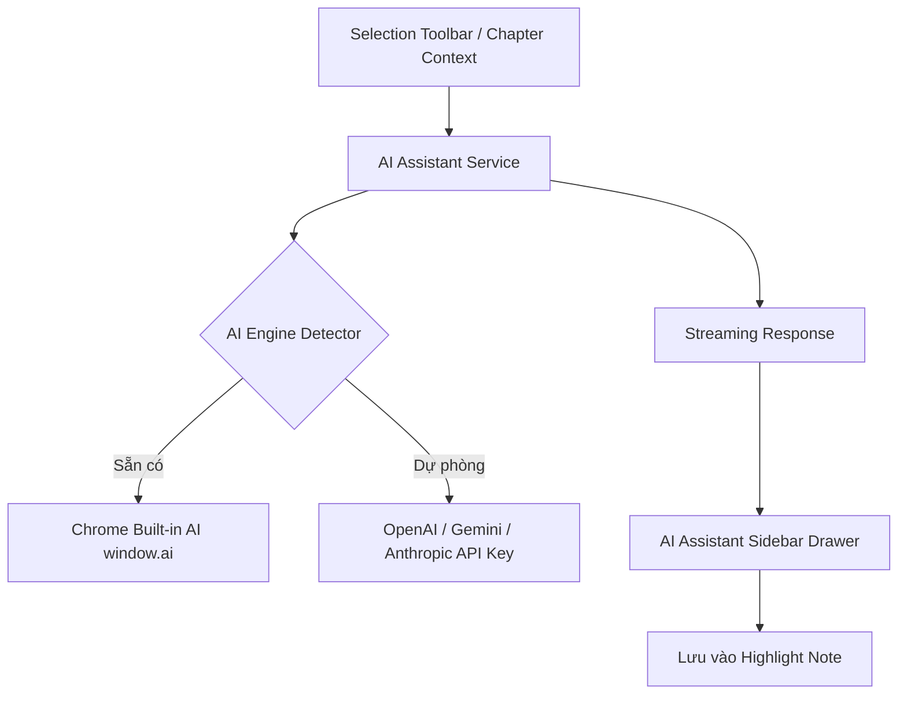

# Giai Đoạn 8: Trợ Lý AI Đọc Sách Ngữ Cảnh (AI Reading Co-Pilot)

## 🎯 Mục Tiêu
Biến Velvet thành một trình đọc sách thông minh vượt trội với sự hỗ trợ của AI. Giúp người đọc tóm tắt nội dung chương sách, giải thích các khái niệm/nhân vật phức tạp, và dịch thuật ngữ cảnh văn học theo đúng mạch truyện.

---

## 🏗️ Kiến Trúc Module

---

## 📋 Các Thành Phần Kỹ Thuật

### 1. AI Service Client (`src/services/aiService.ts`)
- Hỗ trợ đa nguồn AI:
  * **Tier 1 (Zero-Config / Private):** Chrome Built-in AI Prompt API (`window.ai.languageModel` / Gemini Nano chạy trực tiếp trên máy người dùng, không tốn token, bảo mật 100%).
  * **Tier 2 (Custom Key):** Hỗ trợ nhập API Key cá nhân (Gemini 1.5 Flash, OpenAI GPT-4o-mini, Claude 3.5 Haiku).
- Các chức năng AI chuyên sâu cho việc đọc sách:
  * `summarizeChapter(chapterText)`: Tóm tắt 3-5 ý cốt lõi của chương trước khi đọc.
  * `explainConcept(selectedText, contextSentence)`: Giải thích thuật ngữ, nhân vật lịch sử, hoặc triết học trừu tượng.
  * `translateLiterary(selectedText, targetLang)`: Dịch thuật ngữ cảnh văn chương, giữ nguyên văn phong thay vì dịch thô từ điển.
  * `askBook(question, context)`: Hỏi đáp thông tin về cuốn sách đang đọc.

### 2. Tích Hợp Selection Toolbar & AI Sidebar Drawer (`src/components/ai/AICoPilotDrawer.tsx`)
- Thêm nút **"✨ Hỏi AI"** trực tiếp trên **Floating Selection Toolbar**.
- Mở ngăn kéo trợ lý AI bên phải màn hình:
  * Hiển thị câu trả lời stream gõ từng chữ (Typing Effect).
  * Nút **"Lưu thành Ghi Chú"** (1-click chuyển câu trả lời của AI thành ghi chú đính kèm của Highlight trong sách).
  * Lịch sử hỏi đáp trong cuốn sách hiện tại.

### 3. Cài Đặt AI Settings (`src/components/settings/AISettingsSection.tsx`)
- Tùy chọn nguồn AI (Chrome Local AI / Custom API Key).
- Tùy chọn ngôn ngữ giải thích mặc định (Tiếng Việt / Tiếng Anh).

---

## 🧪 Kế Hoạch Kiểm Thử
1. Bôi đen một đoạn văn triết học hoặc thuật ngữ &rarr; Bấm "Hỏi AI" &rarr; Xem câu trả lời hiển thị stream mượt mà.
2. Bấm "Lưu thành Ghi Chú" &rarr; Kiểm tra ghi chú xuất hiện trong Navigation Drawer và được xuất ra file Markdown.
3. Chạy thử nghiệm tóm tắt toàn bộ chương sách.
