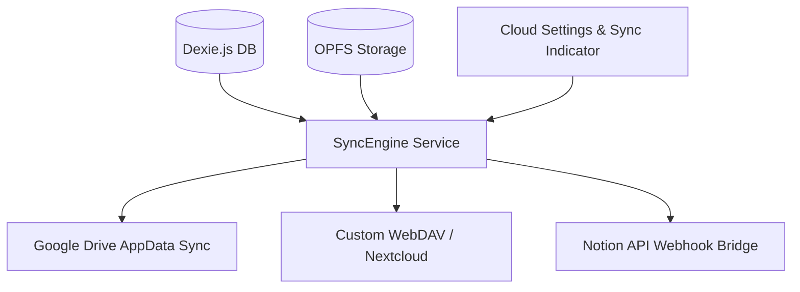

# Giai Đoạn 9: Đồng Bộ Đám Mây & Sao Lưu (Cloud Sync & Notion/Obsidian Bridge)

## 🎯 Mục Tiêu
Cung cấp khả năng sao lưu toàn bộ thư viện sách, vị trí đọc (`EPUB-CFI`), toàn bộ highlight và ghi chú lên các dịch vụ lưu trữ đám mây (Google Drive, WebDAV) để đồng bộ đa thiết bị, đồng thời hỗ trợ 1-click đẩy ghi chú trực tiếp vào cơ sở dữ liệu Notion / Obsidian.

---

## 🏗️ Kiến Trúc Module

---

## 📋 Các Thành Phần Kỹ Thuật

### 1. Cloud Sync Engine (`src/services/syncService.ts`)
- **Chiến lược đồng bộ (Sync Strategy)**:
  * Two-way CRDT hoặc Timestamp-based Last-Write-Wins trên từng bản ghi `[bookId+createdAt]`.
  * Đồng bộ tự động sau mỗi phiên đọc (hoặc định kỳ 10 phút).
- **Google Drive Integration**:
  * Sử dụng Chrome Identity API (`chrome.identity.getAuthToken`).
  * Lưu trữ file cấu hình `velvet_backup.json` và tệp sách `.epub` vào thư mục bảo mật `appDataFolder` của Google Drive (người dùng không bị rối file trên Drive chính).
- **WebDAV Support**:
  * Kết nối máy chủ lưu trữ cá nhân (Nextcloud, Synology NAS, Koofr).

### 2. Notion & Webhook Bridge (`src/services/notionService.ts`)
- Tích hợp Notion API để đồng bộ ghi chú:
  * Tự động tạo một Database "Velvet Reading Hub" trên Notion.
  * Mỗi cuốn sách tạo một trang (Page), các đoạn Highlight và ghi chú được đẩy vào dưới dạng Callout Block `> [!QUOTE]`.
  * Cập nhật theo thời gian thực mỗi khi người dùng bôi đen đoạn mới.

### 3. Giao Diện Quản Lý Sao Lưu (`src/components/settings/CloudSyncSection.tsx`)
- Hiển thị trạng thái đồng bộ: *Đã đồng bộ lúc 10:30 AM*, *Đang tải lên...*
- Nút bấm **"Sao Lưu Ngay (Backup Now)"** và **"Khôi Phục (Restore)"**.
- Xuất toàn bộ cơ sở dữ liệu ra tệp nén `.velvet-backup` để chuyển máy tính tức thì.

---

## 🧪 Kế Hoạch Kiểm Thử
1. Kết nối tài khoản Google Drive &rarr; Đồng bộ dữ liệu.
2. Mở trình duyệt trên profile khác hoặc xóa dữ liệu test &rarr; Khôi phục toàn bộ sách và ghi chú từ Cloud.
3. Kiểm tra trích dẫn được đồng bộ chuẩn cấu trúc lên Notion Database.
